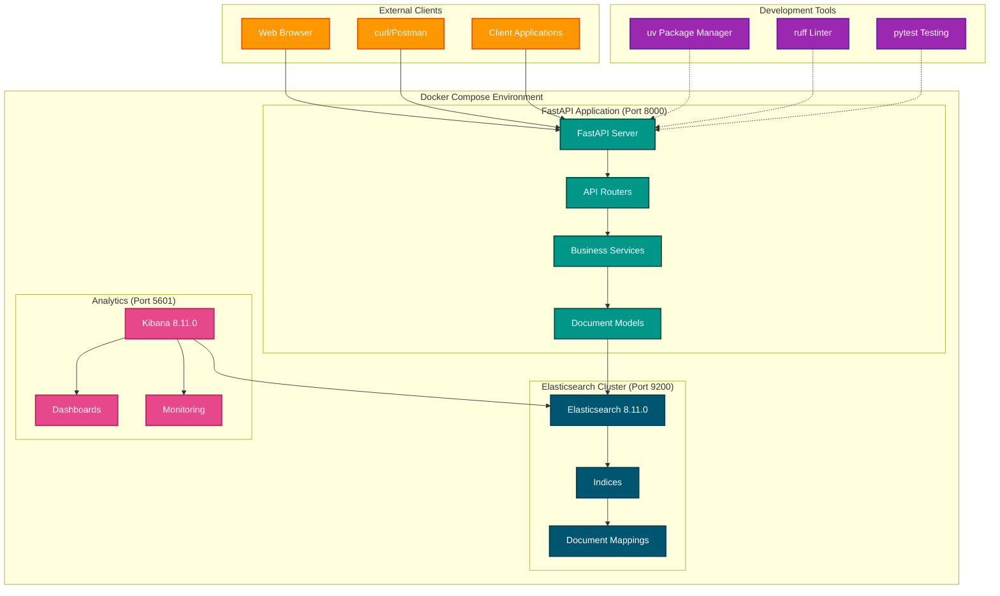

# FastAPI Elasticsearch Application

A modern FastAPI application with Elasticsearch integration for document storage and search capabilities.

> 🤖 **AI-Assisted Development**: This project was developed with assistance from AI tools.

## Features

- **FastAPI** web framework with automatic OpenAPI documentation
- **Elasticsearch** integration using elasticsearch-dsl
- **Docker Compose** setup for easy local development
- **CRUD operations** for articles and users
- **Advanced search** with filters and pagination
- **Health monitoring** endpoints
- **Modern Python tooling** (uv, ruff, pytest)

## Tech Stack

- **Backend**: FastAPI, Python 3.11+
- **Search Engine**: Elasticsearch 8.11.0 (LTS)
- **Analytics**: Kibana 8.11.0 (LTS)
- **Package Manager**: uv
- **Linting/Formatting**: ruff
- **Testing**: pytest
- **Containerization**: Docker & Docker Compose

## Architecture



### Component Overview

| Component | Purpose | Technology | Port |
|-----------|---------|------------|------|
| **FastAPI App** | REST API server with automatic docs | FastAPI + uvicorn | 8000 |
| **Elasticsearch** | Document storage and search engine | Elasticsearch 8.11.0 | 9200 |
| **Kibana** | Analytics and data visualization | Kibana 8.11.0 | 5601 |

### Data Flow

1. **API Requests** → FastAPI receives HTTP requests
2. **Business Logic** → Service layer processes requests  
3. **Data Operations** → elasticsearch-dsl interacts with Elasticsearch
4. **Document Storage** → Articles and users stored as documents
5. **Search Operations** → Full-text search with filters and pagination
6. **Analytics** → Kibana visualizes data and monitors indices

## Quick Start

### Prerequisites

- Docker and Docker Compose
- Python 3.11+
- uv package manager (install with `curl -LsSf https://astral.sh/uv/install.sh | sh`)

### 1. Clone and Setup

```bash
git clone <repository-url>
cd python-elasticsearch
```

### 2. Environment Configuration

```bash
# Copy environment template
cp .env.example .env

# Edit .env if needed (optional for local development)
# ELASTICSEARCH_URL=http://localhost:9200
# ELASTICSEARCH_INDEX_PREFIX=app
```

### 3. Run with Docker Compose (Recommended)

```bash
# Start all services (Elasticsearch, Kibana, FastAPI)
docker-compose up -d

# View logs
docker-compose logs -f

# Stop services
docker-compose down
```

### 4. Run Locally (Alternative)

```bash
# Initialize uv project (if not already done)
uv sync

# Start Elasticsearch and Kibana only
docker-compose up -d elasticsearch kibana

# Run FastAPI development server
uv run uvicorn main:app --reload
```

## Services

Once running, the following services will be available:

- **FastAPI Application**: http://localhost:8000
- **API Documentation**: http://localhost:8000/docs
- **Elasticsearch**: http://localhost:9200
- **Kibana**: http://localhost:5601

## API Endpoints

### Health Checks

- `GET /health/` - Overall health check
- `GET /health/elasticsearch` - Elasticsearch health check

### Articles

- `POST /documents/articles` - Create article
- `GET /documents/articles` - Search articles with filters
- `GET /documents/articles/{id}` - Get article by ID
- `PUT /documents/articles/{id}` - Update article
- `DELETE /documents/articles/{id}` - Delete article

### Users

- `POST /documents/users` - Create user
- `GET /documents/users/{id}` - Get user by ID

## Usage Examples

### Create an Article

```bash
curl -X POST "http://localhost:8000/documents/articles" \
  -H "Content-Type: application/json" \
  -d '{
    "title": "Getting Started with FastAPI",
    "content": "FastAPI is a modern Python web framework...",
    "author": "John Doe",
    "category": "technology",
    "tags": ["python", "fastapi", "web"],
    "views": 0,
    "rating": 5.0
  }'
```

### Search Articles

```bash
# Search by query
curl "http://localhost:8000/documents/articles?query=fastapi"

# Filter by category
curl "http://localhost:8000/documents/articles?category=technology"

# Filter by tags
curl "http://localhost:8000/documents/articles?tags=python&tags=web"

# Pagination
curl "http://localhost:8000/documents/articles?limit=5&offset=10"
```

### Create a User

```bash
curl -X POST "http://localhost:8000/documents/users" \
  -H "Content-Type: application/json" \
  -d '{
    "username": "johndoe",
    "email": "john@example.com",
    "full_name": "John Doe",
    "bio": "Software developer and tech enthusiast",
    "is_active": "true"
  }'
```

## Development

### Install Dependencies

```bash
# Install project dependencies
uv sync

# Install with development dependencies
uv sync --dev
```

### Code Quality

```bash
# Lint and format code
uv run ruff check .
uv run ruff format .

# Fix auto-fixable issues
uv run ruff check --fix .
```

### Testing

```bash
# Run all tests
uv run pytest

# Run with coverage
uv run pytest --cov=app tests/

# Run specific test file
uv run pytest tests/test_documents.py

# Run specific test
uv run pytest tests/test_documents.py::test_create_article
```

### Development Server

```bash
# Start with auto-reload
uv run uvicorn main:app --reload

# Start with specific host/port
uv run uvicorn main:app --host 0.0.0.0 --port 8000 --reload
```

## Docker Commands

### Build and Run

```bash
# Build and start all services
docker-compose up --build

# Run in background
docker-compose up -d

# View logs
docker-compose logs -f fastapi
docker-compose logs -f elasticsearch
```

### Maintenance

```bash
# Stop all services
docker-compose down

# Remove volumes (WARNING: deletes all data)
docker-compose down -v

# Rebuild containers
docker-compose build --no-cache
```

## Elasticsearch Management

### Access Elasticsearch

```bash
# Check cluster health
curl http://localhost:9200/_cluster/health

# List indices
curl http://localhost:9200/_cat/indices?v

# View index mapping
curl http://localhost:9200/app_articles/_mapping
```

### Kibana Access

Visit http://localhost:5601 to access Kibana for:
- Data visualization
- Index management
- Query debugging
- Monitoring

## Configuration

### Environment Variables

| Variable | Default | Description |
|----------|---------|-------------|
| `ELASTICSEARCH_URL` | `http://localhost:9200` | Elasticsearch connection URL |
| `ELASTICSEARCH_INDEX_PREFIX` | `app` | Prefix for Elasticsearch indices |

### Docker Compose Configuration

The `docker-compose.yml` configures:
- Elasticsearch with security disabled for development
- Kibana connected to Elasticsearch
- FastAPI app with hot reload
- Persistent volumes for Elasticsearch data

## Troubleshooting

### Common Issues

1. **Port conflicts**: Change ports in `docker-compose.yml` if needed
2. **Memory issues**: Increase Docker memory allocation for Elasticsearch
3. **Connection refused**: Ensure Elasticsearch is healthy before starting FastAPI

### Health Checks

```bash
# Check if services are running
docker-compose ps

# Check Elasticsearch health
curl http://localhost:9200/_cluster/health

# Check FastAPI health
curl http://localhost:8000/health/
```

### Logs

```bash
# View all logs
docker-compose logs

# View specific service logs
docker-compose logs elasticsearch
docker-compose logs kibana
docker-compose logs fastapi
```

## Project Structure

```
├── app/
│   ├── core/                 # Core configuration and connections
│   ├── models/               # Elasticsearch document models
│   ├── routers/              # API route handlers
│   └── services/             # Business logic layer
├── tests/                    # Test suite
├── docker-compose.yml        # Docker services configuration
├── Dockerfile               # FastAPI container definition
├── pyproject.toml          # Project configuration and dependencies
├── uv.lock                 # Lock file for reproducible builds
└── CLAUDE.md               # Development guidance
```

## Contributing

1. Follow the coding standards defined in `pyproject.toml`
2. Run tests before submitting changes: `uv run pytest`
3. Use ruff for code formatting and linting: `uv run ruff check . && uv run ruff format .`
4. Update documentation for new features
5. Ensure uv.lock is updated when adding dependencies

## License

This project is licensed under the MIT License.